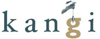
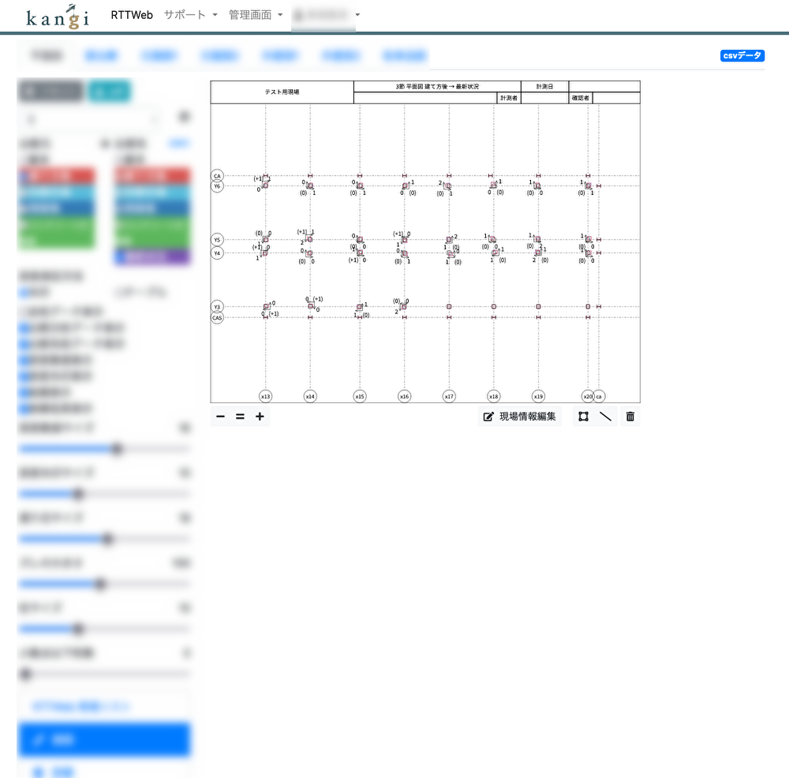
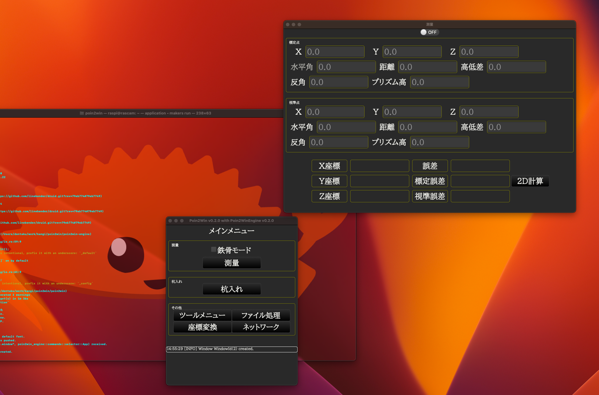

<h1 style="font-weight:normal">
    
</h1>

<h1 style="font-weight:normal">
    
</h1>

これはプログラマ向けページです。

## $\textcolor{green}{\text{関技とは}}$

奈良に事務所を構える**測量会社**です。
測量業務を行う社員とプログラミングを行う学生アルバイトがいます。

- 事務所所在地：奈良県香芝市
  - 近鉄大阪線 [五位堂駅] 徒歩10分
- 社員：10人程度
- プログラム組：アルバイトの京大生（現在5人）
  - 主な作業場所は京大構内および事務所です。
  - OB・OGは企業や大学でエンジニアリングを仕事にしています。
- 会社ホームページ：[kangi-web]

## $\textcolor{blue}{\text{主な仕事内容}}$

測量を補助するプロダクトを新規開発したり、開発したプロダクトの保守・運用を行います。
Webシステム、デスクトップアプリ、センサーやラズパイを用いたIoTなど問題解決のために特定の技術に捉われることなく開発を行います。
バイト約5人体制の小規模な運営で、代々京大生の間で引き継いでいます。

## $\textcolor{magenta}{\text{具体的なプロジェクト例}}$

「測量を行うにあたりこういう状況で使えるアプリケーションを作って欲しい」という要望を解決するソフトウェア・ハードウェアの開発をします。
技術選定は適切に問題解決でき妥当性があるなら比較的自由です。
以下はプロジェクトの簡単な紹介です。

Webシステムの例

- 機能
  - 測量した座標と設計値/過去の測量値とを比較し誤差などをビジュアライズ
- 使用技術
  - [React]、[Ruby on Rails]など（[Next.js]で書き換え中）
  - [Electron]を使ってデスクトップアプリ化も

デスクトップアプリケーションの例

- 機能
  - トータルステーションと呼ばれる測量機器と通信する
  - 測量値のプロットや測量値と設計値との誤差を表示
  - 設計値から正しい座標を計算し、トータルステーションを操作　など
- 使用技術
  - [C++]、[Visual Studio]など（画像は[Rust]を用いて書き換え中のもの）

## $\text{要項}$

以下は大学生協で応募した際の掲示内容です。
詳しくは掲示やビラをご参照ください。

- 給与：月給制，3万〜（実力に応じて要相談）
- 時間・場所（毎週土曜日の3時間，テスト前や外せない用事があれば欠席可）
  - 第四土曜日以外の土曜日：京大構内，15:30〜18:30
  - 第四土曜日：事務所，17:30〜20:30
- 使用技術
  - 言語：[C++]，[TypeScript]，[Rust] など
  - ソフトウェア，フレームワーク等：[Linux]，[Docker]，[Next.js]，[MySQL]，[Electron]，[Druid]，[Raspberry Pi]など
- 対象，以下を満たすのが好ましい
  - 4年以上勤務できる大学生/大学院生
  - プログラミングを学ぶモチベーション，既存のプログラムを改善していく意欲のある方
  - 現在のコンピュータに関する知識レベルは問わない
  - プログラミング初心者も歓迎，研修期間あり（その間の減給なし）
  - Windows，Mac，もしくはLinuxのノートPCを持参のこと
- 採用の決め方
  - 選考して採用（Google Formに必要事項記入後，面接等）

### Contact

<!-- links -->
[kangi-web]: http://www.kangi3d.com/ "kangi-web"
[五位堂駅]: https://www.google.com/maps/d/u/0/viewer?msa=0&hl=ja&brcurrent=3%2C0x60012dd503ee53eb%3A0x3818aff010d2c238%2C0&ie=UTF8&t=m&ll=34.53516199999999%2C135.71860099999998&spn=0.001547%2C0.00228&z=18&source=embed&mid=1mJD8VA2nL0Sizrk8f_CqswNOISk
[C++]: https://en.cppreference.com/w/
[TypeScript]: https://www.typescriptlang.org/
[Rust]: https://www.rust-lang.org/
[Linux]: https://www.linux.org/
[Docker]: https://www.docker.com/
[Next.js]: https://nextjs.org/
[MySQL]: https://www.mysql.com/jp/
[Electron]: https://www.electronjs.org/
[Druid]: https://github.com/linebender/druid
[Raspberry Pi]: https://www.raspberrypi.org/
[React]: https://react.dev/
[Ruby on Rails]: https://rubyonrails.org/
[Visual Studio]: https://visualstudio.microsoft.com/ja/
<!-- links -->
